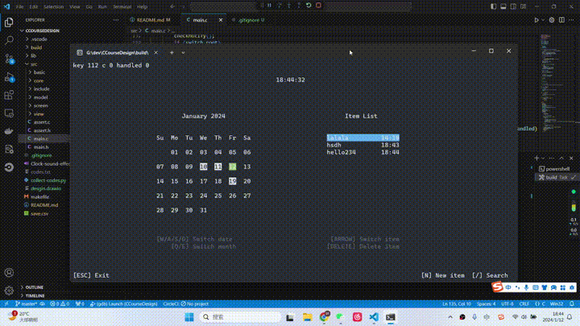

# C语言程序设计课设

## 简介
C语言实现的一个日程安排的控制台应用。

由三个页面组成：
* 主页
* 新建日程页
* 搜索页

核心是实现了简单地view数据结构和功能，提供组件化布局、输出和功能响应支持。
还有就是通过console功能模块在view和控制台屏幕间搭建桥梁，使用内存缓冲区作为view的直接输出，
然后在输出同步的时候比对新旧缓冲区的变化，按需输出到屏幕，减少屏幕输出操作，从而提高程序运行速度，避免了屏闪。

## 文件目录说明
* lib放了一个从C:/Windows/System32复制的winmm.dll，不然mingw
* src目录是源代码目录
* src/main.c        主程序
* src/basic         基础的数据结构，目前放了个动态数组array.c
* src/core          核心数据结构功能，view和console
* src/include       一些头文件
* src/model         业务数据相关的操作，只有item.c，进行事项列表加载、添加、删除、保存、筛选等
* src/screen        定义三个屏幕页面，屏幕本身也是在view的基础上扩展的，相当于继承view
* src/view          各种view组件，比如日历组件、列表组件、输入组件等
* collect-codes.py  用来收集程序代码的，在写报告的时候可能有用，输出【<文件相对路径>】<换行><文件内容>
* makefile          make文件，用来组织编译程序
* video.mp4         未加速的视频

## 运行说明
* 我使用mingw的开发环境，配备make等命令，在vscode编辑器进行开发
* 编译好的程序在build/main.exe
* 默认tasks.json使用make命令，支持编译结果缓存
* 如果没有make命令，可以参照tasks.no-make.json作为tasks.json
* 修改.vscode文件夹下launch.json中的调试器路径
* 按`F5`运行

## 效果展示

